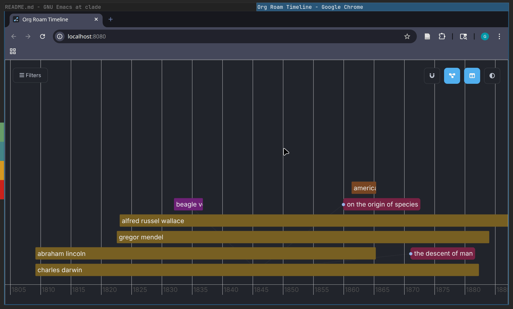
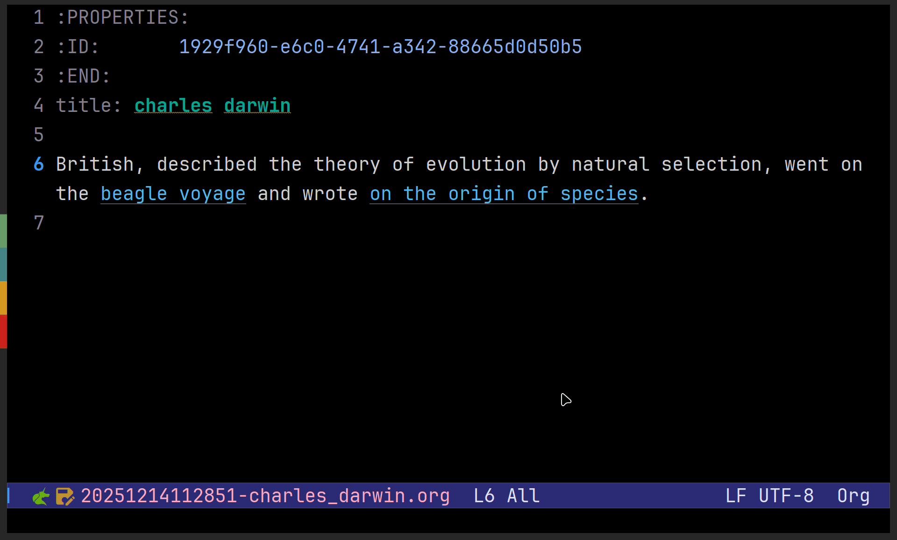

# org-roam-timeline: A visual interface for org-roam dated nodes.



**Table of Contents**

- [Installation](#installation)
- [Usage](#usage)
- [Features ✨](#features-)
- [License](#licence)

Org-Roam-Timeline creates an interactive, browser-based timeline of your [org-roam](https://github.com/org-roam/org-roam) notes, allowing you to visualize historical context, filter by tags, and seamlessly navigate between your timeline and your text editor.

It is designed for researchers, historians, and anyone who needs to see /when/ their ideas happened, not just how they link together.

## Installation

### Clone repo

`org-roam-timeline` is yet not on MELPA, but you can still use it

```bash

git clone git@github.com:GerardoCendejas/org-roam-timeline.git

```

### Emacs config

You then should add something like this to your `init.el`, this are the keybindings that I find useful, but feel free to change them.

```emacs-lisp

(use-package org-roam-timeline
       :after org-roam
       :load-path "~/.emacs.d/lisp/org-roam-timeline/"  ; Adjust path as needed
       
       :bind (("C-c n p" . org-roam-timeline-open)       ; Open the Timeline View
              ("C-c n d" . org-roam-timeline-add-date)   ; Add/Edit Timeline Date
              ("C-c n s" . org-roam-timeline-show-node)  ; Force Show Node in Browser
     	      ("C-c n h" . org-roam-timeline-hide-node)  ; Force Hide Node in Browser
              ("C-c n t" . org-roam-timeline-tag-add)    ; Add Tag (Smart Completion)
	      ("C-c n z" . org-roam-timeline-zoom-date)  ; Focus the view on a specified date
     	 )
     	 
       
       :custom
       
       ;; Default zoom range (years) when focusing a single point
       (org-roam-timeline-focus-window-years 5)

       ;; Start with connection lines enabled?
       (org-roam-timeline-show-links-on-start t)

       ;; Enable "Follow Me" mode by default? (Timeline tracks your cursor)
       (org-roam-timeline-follow-mode-on-start t)

       ;; Disable the minibuffer with note content in the UI
       (org-roam-timeline-preview-on-start nil)
       
       :config
       (message "Org-Roam Timeline loaded."))

```

Check other functions included that you could bind if you want complete control from emacs, such as 

### Customization

You can customize the appearance via `M-x customize-group org-roam-timeline`.

- `org-roam-timeline-default-theme`: Choose `'dark` (default) or `'light`.
- `org-roam-timeline-focus-window-years`: How many years +/- to show when focusing a point event.

## Usage

### Adding data to Notes

The timeline relies on two properties: `TIMELINE_START` and (optionally) `TIMELINE_END`.

- Run `C-c n d` (or `M-x org-roam-timeline-add-date`) inside any note.
- Enter a date (Formats: `YYYY`, `YYYY-MM`, or `YYYY-MM-DD`).
- If it's a range, answer "y" and enter the end date.

### Adding Tags to Notes
Org-Roam Timeline uses tags to categorize and filter nodes, so I highly encourage the use of them for easier visual filtering.

- Run `C-c n t` (or `M-x org-roam-timeline-tag-add`) inside any note.
- Enter one or more tags (separated by colons, e.g., `Event:Person:War`), they should not have spaces.

  
### Viewing the Timeline
- Run `C-c n p` (`org-roam-timeline-open`).
- Your default browser will open the visualization.
  

### Navigation & Filtering
- Scroll: Mouse wheel to move forward and backward.
- Zoom: Ctrl + Mouse Wheel to zoom in/out.
- Focus: Click any node to "Focus". This dims other nodes but the ones connected to this.
- Follow Mode: If enabled, moving your cursor in Emacs will automatically pan the timeline to that node (if it has a date).
- Hard Block: In the sidebar, click the Eye Icon next to a tag to hide /all/ nodes with that tag, even if they match other filters.



## Features
- Bi-Directional Sync:
  - Emacs \to Browser: Command `org-roam-timeline-show-node` instantly focuses and zooms to the node in the timeline.
  - Browser \to Emacs: Clicking "Open in Emacs" jumps to the exact node in your buffer.
- Focus Mode: Selecting a node dims unrelated items and highlights only the direct connections (links).
- Visual Filtering:
  - Include: Left-click tags to filter the view.
  - Hard Block: Click the "Eye" icon to explicitly hide specific tags (e.g., exclude "Person" to see only "Events").
- Rich Tooltips: Hover over nodes to see color-coded tag pills and date ranges.
- Glassmorphism UI: A modern, dark-mode interface that fits focused research workflows.

### FROM EMACS 🤯

You can manipulate these filters and behaviours without leaving your emacs.

- org-roam-timeline-show-node: show the present node.
- org-roam-timeline-hide-node: hide the present node.
- org-roam-timeline-toggle-follow: turn on/off the following behaviour (when org-roam-timeline show the node you are at in emacs).
- org-roam-timeline-toggle-preview: turn on/off the showing of note content in the ui.
- org-roam-timeline-filter-toggle: turn on/off wether to include nodes with some tag.
- org-roam-timeline-filter-block: force all nodes with that tag to hide, even if they have other of the include tags.
- org-roam-timeline-filter-reset: clear all the filters.
- org-roam-timeline-filter-hide-all: hide all nodes, from there, you decide what to see.

[org-roam-timeline](media/follow.gif)

## Licence

GPLv3